# Лабораторная работа №1. Виртуальный сервер

## Студент
**Gachayev Dmitrii I2302**  
**Выполнено 16.02.2025_**  

## Описание задачи
В этой лабораторной работе рассматривается процесс виртуализации операционных систем и настройка виртуального HTTP сервера. В рамках выполнения работы будет развернута виртуальная машина с Debian с использованием гипервизора QEMU, установлен LAMP, а также настроены PhpMyAdmin и Drupal.
## Выполнение работы
## Установка доп. по: 
1. Скачиваю дистрибутив Debian для серверов для архитектуры x64 (без графического интерфейса) и систему виртуализации (гипервизор) QEMU.
## Установка ОС Debian на виртуальную машину
1. В консоли выполняю следующую команду, тем самым создаю образ диска для виртуальной машины размером 8 ГБ, формата qcow2:
   ```sh
   qemu-img create -f qcow2 debian.qcow2 8G
   ```
   
   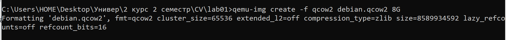
   
3. Запускаю установку OC Debian командой:
   ```sh
   qemu-system-x86_64 -hda debian.qcow2 -cdrom dvd/debian.iso -boot d -m 2G
   ```
   
   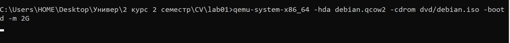
   
4. Установку Debian произвожу со следующими параметрами: 
   - Имя компьютера: **debian**
   - Хостовое имя: **debian.localhost**
   - Имя пользователя: **user**
   - Пароль пользователя: **password**
     
     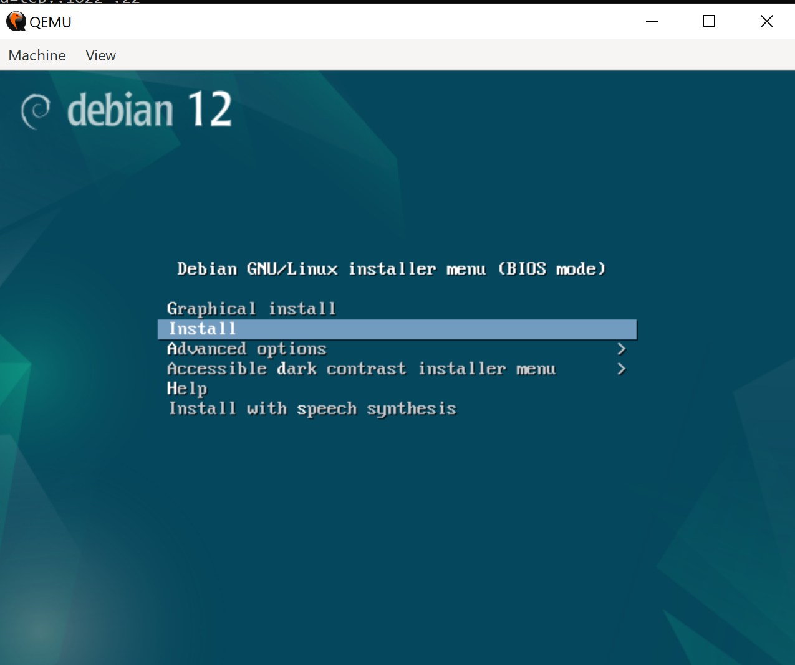
     
5. Запуск виртуальной машины
   После установки с помощью следующей команды система загружается с виртуального жесткого диска debian.qcow2, используя 2 ГБ оперативной памяти и 2 ядра процессора. Также создаётся NAT-сеть и  настраивается проброс портов, что позволяет подключаться к веб-серверу, работающему на виртуальной машине.
   ```
   qemu-system-x86_64 -hda debian.qcow2 -m 2G -smp 2 \ -device e1000,netdev=net0 -netdev user,id=net0,hostfwd=tcp::1080-:80,hostfwd=tcp::1022-:22
   ```
## Установка LAMP
1. Выполняю следующие команды:
 ```
su
apt update -y
apt install -y apache2 php libapache2-mod-php php-mysql mariadb-server mariadb-client unzip

```

**apache2** — это веб-сервер, который обрабатывает HTTP-запросы и раздаёт веб-страницы пользователям, позволяя запускать сайты и веб-приложения.

**php** — интерпретатор языка PHP, необходимый для выполнения серверных скриптов и генерации динамических веб-страниц.

**libapache2-mod-php** — модуль для Apache, который позволяет серверу обрабатывать файлы PHP, интегрируя интерпретатор PHP напрямую с веб-сервером.

**php-mysql** — расширение PHP, обеспечивающее взаимодействие PHP-скриптов с базой данных MySQL или MariaDB.

**mariadb-server** — серверная часть системы управления базами данных MariaDB, которая является форком MySQL и обеспечивает хранение, управление и обработку данных.

**mariadb-client** — клиент для взаимодействия с MariaDB, позволяющий подключаться к серверу базы данных и выполнять запросы через командную строку.
На этом этапе я столкнулся с проблемами, связанными с отсутствием источников в файле sources.list, после их изменения все пакеты были скачаны
Также в будущем оказалось что устанавливаемая версия php слишком стара для Drupal, поэтому я также установил ее отдельно по гайду из интернета

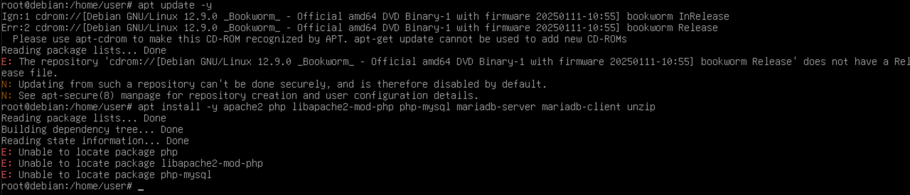

### Установка PhpMyAdmin и CMS Drupal
1. Скачал с помощью следующих команд PhpMyAdmin и CMS Drupal:
   ```sh
   wget https://files.phpmyadmin.net/phpMyAdmin/5.2.2/phpMyAdmin-5.2.2-all-languages.zip
   wget https://ftp.drupal.org/files/projects/drupal-11.1.1.zip
   ```

   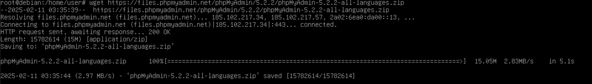

   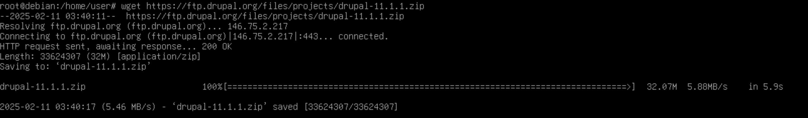
   
3. Проверка наличия файлов:
   ```sh
   ls -l
   ```
   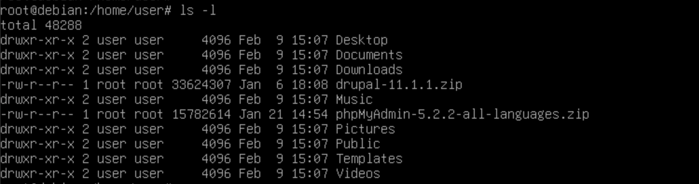

## Распаковка и перемещение файлов:
   ```sh
   unzip phpMyAdmin-5.2.2-all-languages.zip
   unzip drupal-11.1.1.zip
   ```
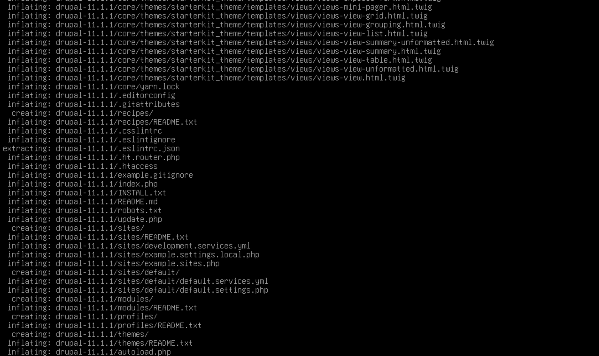

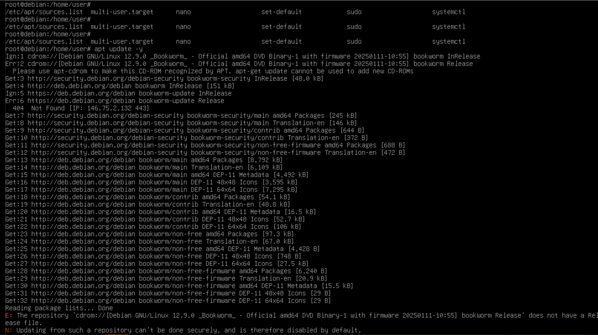
   
   ```sh
   mkdir /var/www
   mv phpMyAdmin-5.2.2-all-languages /var/www/phpmyadmin
   mv drupal-11.1.1 /var/www/drupal
   ```
 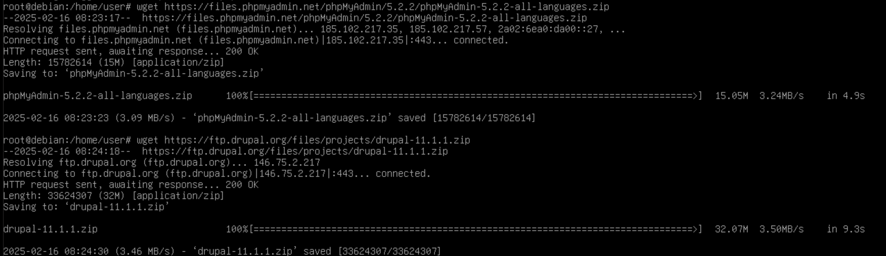

 ### Настройка базы данных

   Создаю через командную строку базу данных drupal_db и пользователя базы данных с названием ***gachayev***
   ```sh
   mysql -u root
   CREATE DATABASE drupal_db;
   CREATE USER 'gachayev'@'localhost' IDENTIFIED BY 'password';
   GRANT ALL PRIVILEGES ON drupal_db.* TO 'gachayev'@'localhost';
   FLUSH PRIVILEGES;
   EXIT;
   ```
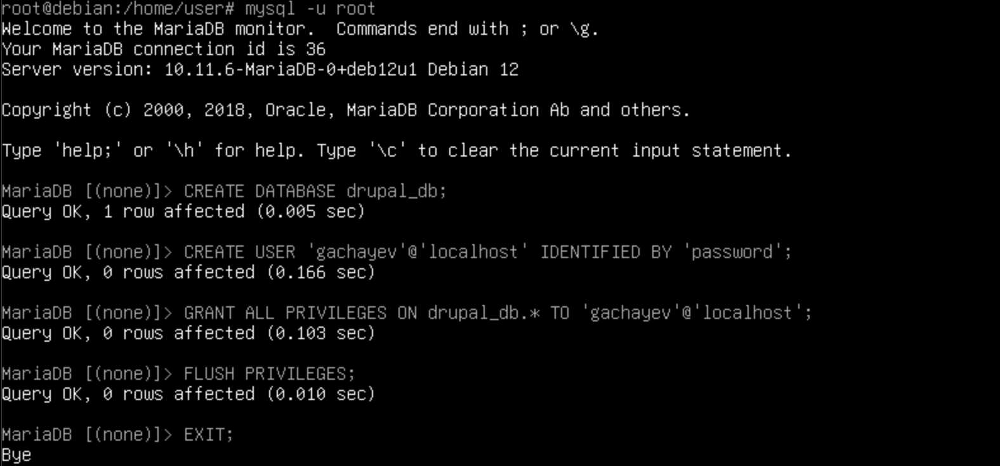

### Настройка виртуальных хостов Apache
1. Создаю файлы:
   - `nano /etc/apache2/sites-available/01-phpmyadmin.conf`

     Вписываю:
      ```
      <VirtualHost *:80>
         ServerAdmin webmaster@localhost
         DocumentRoot "/var/www/phpmyadmin"
         ServerName phpmyadmin.localhost
         ServerAlias www.phpmyadmin.localhost
         ErrorLog "/var/log/apache2/phpmyadmin.localhost-error.log"
         CustomLog "/var/log/apache2/phpmyadmin.localhost-access.log" common
      </VirtualHost>
      ```
      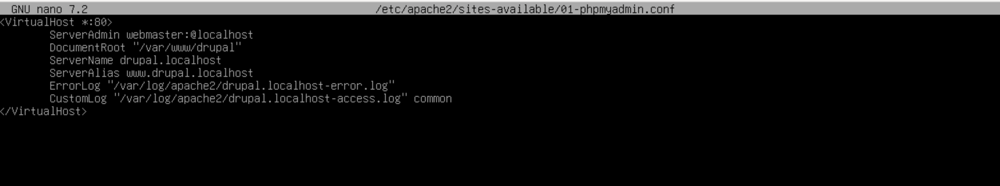
     
   - `nano /etc/apache2/sites-available/02-drupal.conf`
     
      Вписываю:
      ```
      <VirtualHost *:80>
         ServerAdmin webmaster@localhost
         DocumentRoot "/var/www/drupal"
         ServerName drupal.localhost
         ServerAlias www.drupal.localhost
         ErrorLog "/var/log/apache2/drupal.localhost-error.log"
         CustomLog "/var/log/apache2/drupal.localhost-access.log" common
      </VirtualHost>
      ```
      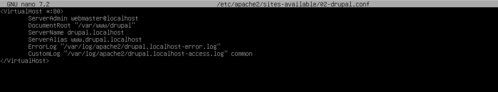

   Далее регистрирую конфигурации и добавляю их в *hosts*:
   ```sh
   /usr/sbin/a2ensite 01-phpmyadmin
   /usr/sbin/a2ensite 02-drupal
   ```
   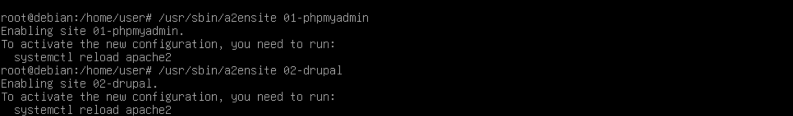

   ### Запуск и тестирование
1. Проверяю версию системы:
   ```sh
   uname -a
   ```
   
   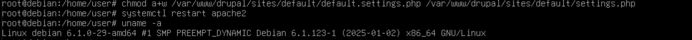
   
3. Перезапускаю Apache:
   ```sh
   systemctl restart apache2
   ```
4. Проверка доступности сайтов в браузере:
   - `http://drupal.localhost:1080`
   - `http://phpmyadmin.localhost:1080`
  
   Оба сайта доступны, продолжаю настройку Drupal
   На этом этапе я столкнулся с проблемной версией php, что я упоминал выше, а так-же с отсутствием директории ***sites/default/files***, которую исправил следующим образом:
   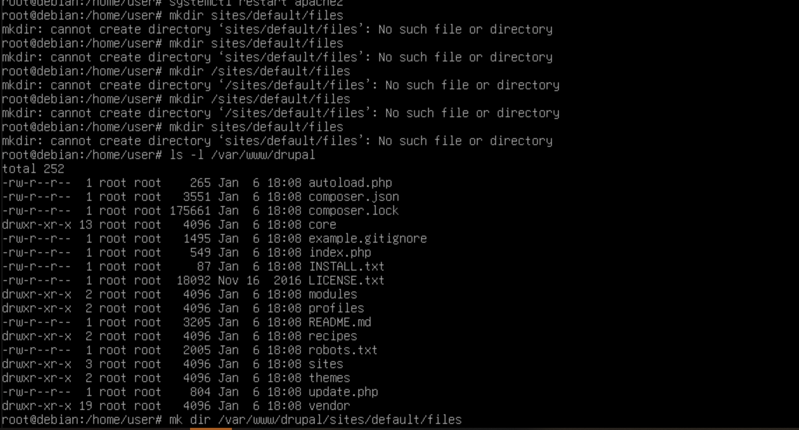

   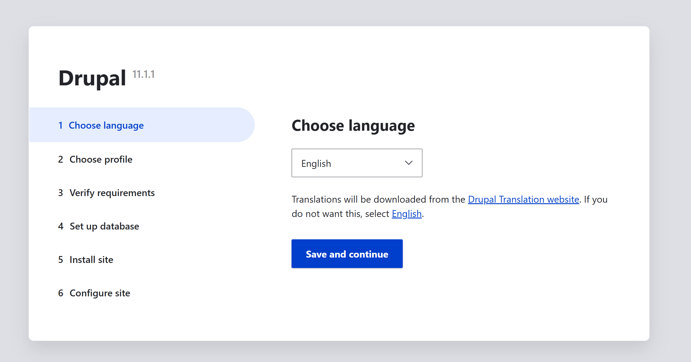

   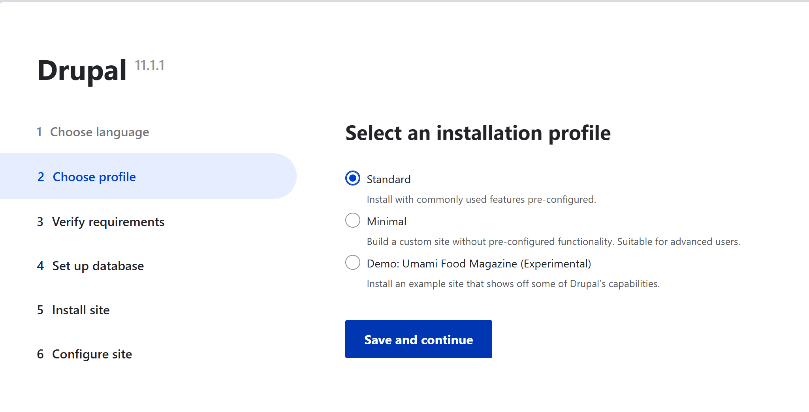

   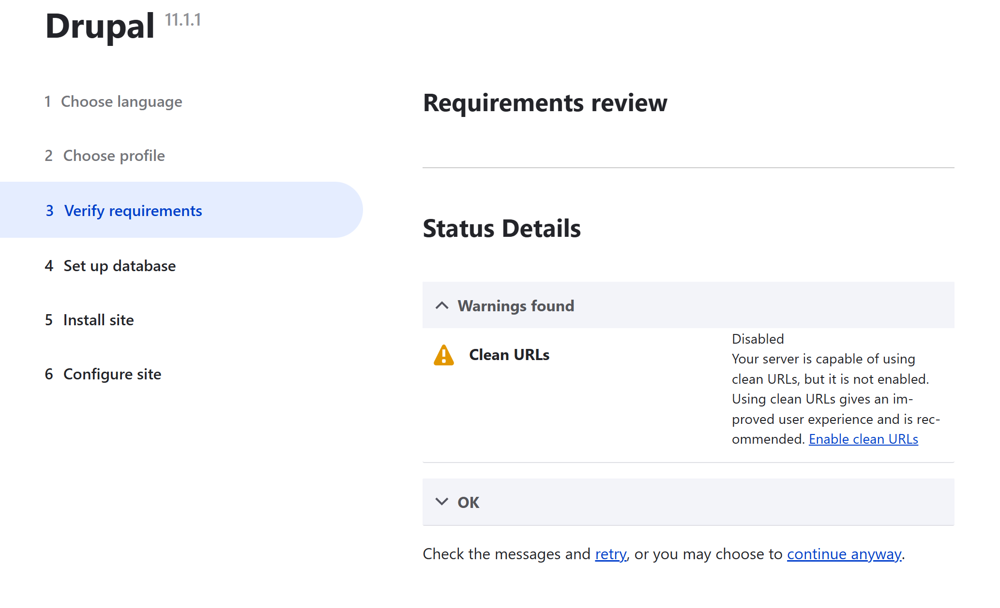

   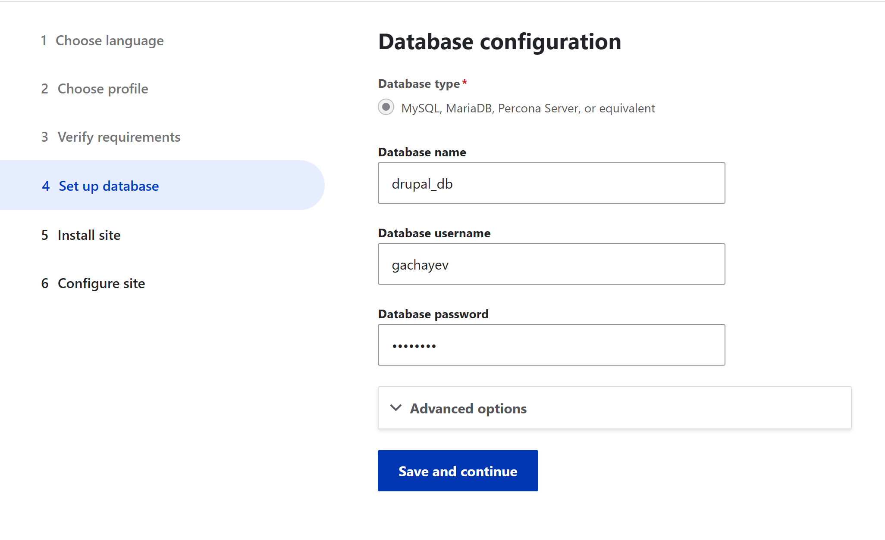

   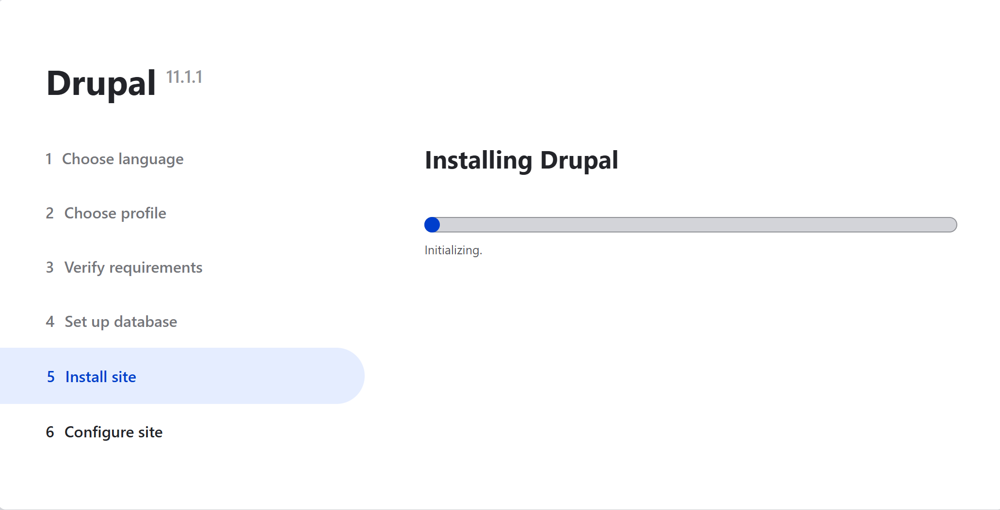

   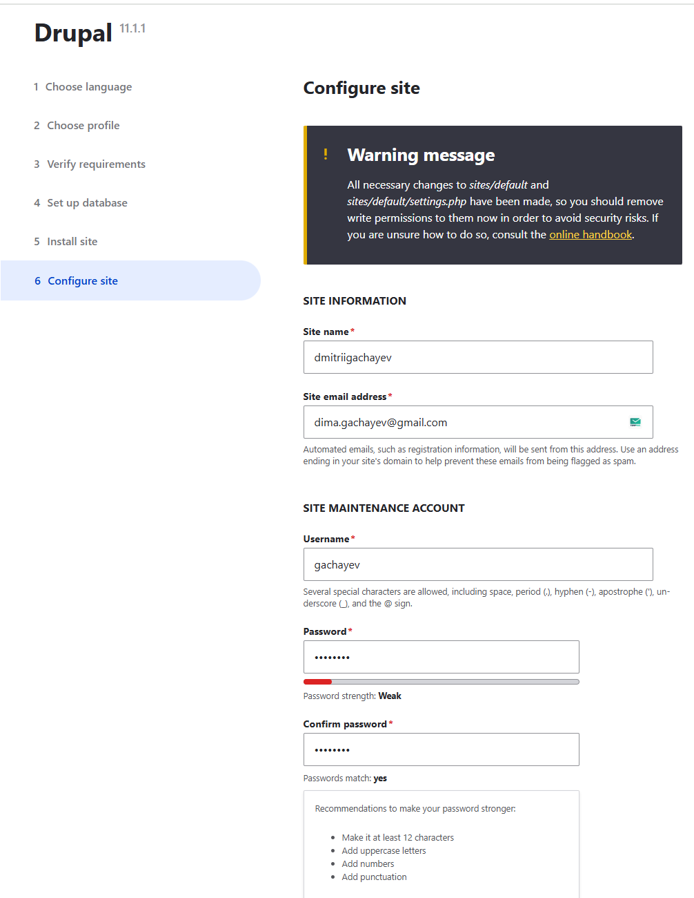

   
